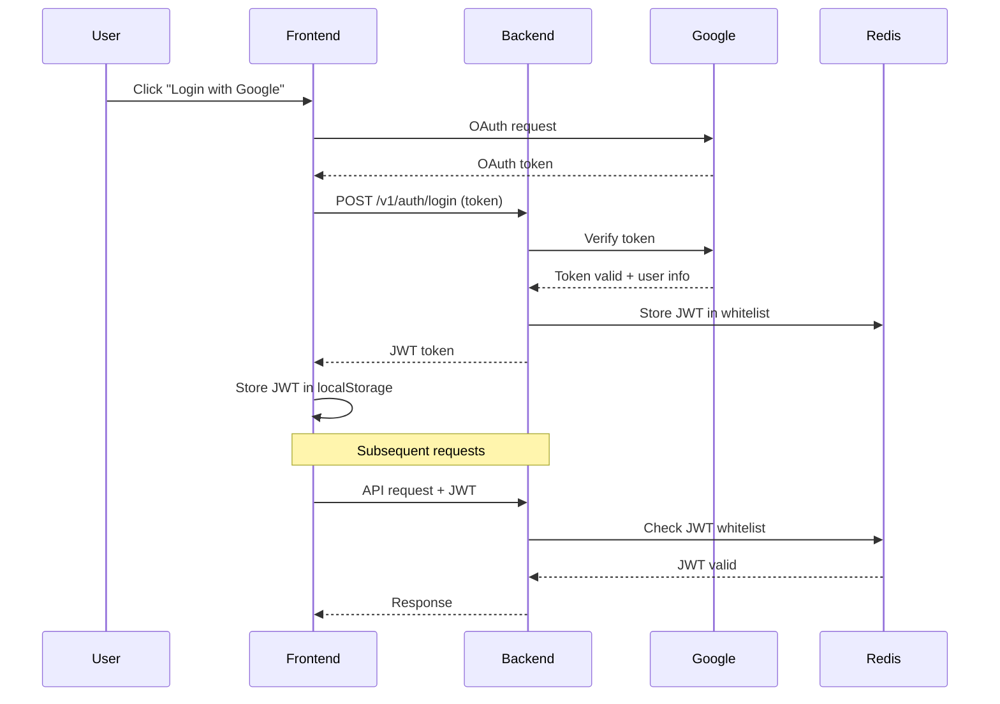

# WealthJourney - Personal Financial Management

<div align="center">
  

**Track expenses • Manage investments • Achieve financial goals**

[](https://nextjs.org/)
[](https://golang.org/)
[](https://www.typescriptlang.org/)
[](LICENSE)

</div>

## 📖 Overview

WealthJourney is a comprehensive personal finance management application that empowers you to take control of your financial future. Track expenses, manage investment portfolios (stocks, crypto, gold, silver), set budgets, and make informed financial decisions through intuitive tracking and insightful analytics.

---

## 📚 Table of Contents

- [Key Features](#-key-features)
- [Screenshots](#-screenshots)
- [Architecture](#-architecture)
- [Quick Start](#-quick-start)
- [Project Structure](#-project-structure)
- [API Design](#-api-design)
- [Development](#-development)
- [Database Schema](#-database-schema)
- [Authentication & Security](#-authentication--security)
- [Testing](#-testing)
- [Deployment](#-deployment)
- [Roadmap](#-roadmap)
- [Contributing](#-contributing)
- [Troubleshooting](#-troubleshooting)
- [FAQ](#-faq)
- [License](#-license)

---

## ✨ Key Features

<table>
<tr>
<td width="50%">

### 💰 Financial Management

- 🏦 Multi-wallet system (Basic & Investment)
- 💸 Transaction tracking with custom categories
- 📊 Income vs expense analysis
- 💰 Budget planning and monitoring
- 📑 Bank CSV import with templates
- 🌐 Multi-currency support (VND, USD, EUR, etc.)

</td>
<td width="50%">

### 📈 Investment Tracking

- 📈 Portfolio management (stocks, ETFs, crypto)
- 🥇 Gold tracking (SJC, DOJI, XAU)
- 🥈 Silver investments
- 💹 Real-time market prices (Yahoo Finance)
- 📊 FIFO cost basis accounting
- 💵 Realized & unrealized PNL

</td>
</tr>
<tr>
<td width="50%">

### 📊 Analytics & Insights

- 📈 Visual spending charts
- 📉 Income trend analysis
- 🎯 Budget progress tracking
- 📊 Portfolio performance metrics
- 💹 Investment returns (daily, monthly, total)
- 📅 Historical data tracking

</td>
<td width="50%">

### 🔒 Security & Experience

- 🔐 Google OAuth authentication
- 🔑 JWT with Redis whitelist
- 📱 Progressive Web App (PWA)
- 🌙 Responsive design (mobile-first)
- ⚡ Real-time updates
- 🔄 Session management across devices

</td>
</tr>
</table>

## 📸 Screenshots

<details>
<summary><strong>Click to view screenshots</strong></summary>

> **Note:** Screenshots coming soon! See `demo` folder for demo images.

**Dashboard:**

- Overview with balance, income, expenses
- Recent transactions
- Budget progress cards

**Investment Portfolio:**

- Holdings table with PNL
- Performance charts
- Investment details with transactions

**Transaction Management:**

- Transaction list with filters
- Add/edit transaction forms
- Category management

**Mobile Experience:**

- Bottom navigation
- Swipeable bottom sheets
- PWA install prompt

</details>

## 🏗️ Architecture

Protocol Buffer-first API design with clean separation of concerns:

```
┌──────────────────────────────────────────────────────┐
│            Protocol Buffers (API Contract)           │
│              Single Source of Truth                  │
└───────────────────┬──────────────────────────────────┘
                    │
       ┌────────────┴────────────┐
       ▼                         ▼
┌─────────────┐          ┌─────────────┐
│  Frontend   │  REST    │   Backend   │
│  Next.js 15 │◄────────►│   Go 1.23   │
│  React 19   │          │  Gin/gRPC   │
│ TypeScript  │          │    GORM     │
└─────────────┘          └──────┬──────┘
                                │
                         ┌──────┴──────┐
                         ▼             ▼
                   PostgreSQL      Redis
                   (Supabase)    (Cache)
```

### Tech Stack

| Layer                | Technology                                            |
| -------------------- | ----------------------------------------------------- |
| **Frontend**         | Next.js 15, React 19, TypeScript 5, Tailwind CSS 3.4  |
| **State Management** | Redux Toolkit (auth), React Query (server state)      |
| **Backend**          | Go 1.23, Gin (REST), gRPC, GORM                       |
| **Database**         | PostgreSQL 16 (Supabase), Redis 7                     |
| **API Layer**        | Protocol Buffers, Buf, ts-proto                       |
| **Auth**             | Google OAuth, JWT with Redis whitelist                |
| **Deployment**       | Vercel (frontend & backend)                           |
| **External APIs**    | Yahoo Finance (market data), vang.today (gold prices) |

## 🚀 Quick Start

### Prerequisites

```bash
Node.js 20+  |  Go 1.23+  |  Docker  |  PostgreSQL 16+  |  Redis 7+
```

### Option 1: Docker (Recommended)

```bash
# Clone the repository
git clone https://github.com/khanhnq1406/Personal_Financial_Management.git
cd Personal_Financial_Management

# Start all services
docker-compose up -d

# Access the application
# Frontend: http://localhost:3000
# Backend API: http://localhost:8080
```

### Option 2: Manual Setup

```bash
# 1. Install dependencies
task setup  # or: npm install && go mod download

# 2. Configure environment variables
cp .env.example .env.local

# Edit .env.local with your credentials:
# - Database (PostgreSQL/Supabase)
# - Redis URL
# - Google OAuth credentials
# - JWT secret

# 3. Run database migrations
task backend:migrate-categories
task backend:migrate-investments
# See all: task --list | grep migrate

# 4. Start development servers
task dev  # Starts both frontend and backend

# Or start separately:
task backend:dev   # Backend on :8080
task frontend:dev  # Frontend on :3000
```

### Environment Variables

<details>
<summary>Click to expand required environment variables</summary>

**Frontend (.env.local)**

```env
NEXT_PUBLIC_API_URL=http://localhost:8080
NEXT_PUBLIC_GOOGLE_CLIENT_ID=your_google_client_id
```

**Backend (.env)**

```env
# Database (PostgreSQL)
DB_HOST=localhost
DB_PORT=5432
DB_USER=postgres
DB_PASSWORD=your_password
DB_NAME=wealthjourney

# Redis
REDIS_URL=localhost:6379

# Authentication
JWT_SECRET=your_jwt_secret_minimum_32_characters
JWT_EXPIRATION=168h
GOOGLE_CLIENT_ID=your_google_client_id
GOOGLE_CLIENT_SECRET=your_google_client_secret

# Optional: Yahoo Finance API
YAHOO_FINANCE_ENABLED=true
YAHOO_FINANCE_CACHE_MAX_AGE=15m
```

</details>

## 📁 Project Structure

```
Personal_Financial_Management/
├── api/                          # Protocol Buffer definitions (API contracts)
│   └── protobuf/v1/
│       ├── auth.proto           # Authentication
│       ├── wallet.proto         # Wallet management
│       ├── transaction.proto    # Transactions & categories
│       ├── investment.proto     # Investment portfolio
│       ├── budget.proto         # Budget management
│       └── import.proto         # Bank statement import
│
├── src/
│   ├── go-backend/              # Go backend (Domain-Driven Design)
│   │   ├── domain/
│   │   │   ├── models/         # GORM database models
│   │   │   ├── repository/     # Data access layer
│   │   │   ├── service/        # Business logic
│   │   │   └── grpcserver/     # gRPC implementations
│   │   ├── handlers/           # REST API handlers
│   │   ├── pkg/
│   │   │   ├── yahoo/          # Yahoo Finance API client
│   │   │   ├── gold/           # Gold conversion utilities
│   │   │   └── cache/          # Redis caching
│   │   └── cmd/                # CLI commands & migrations
│   │
│   └── wj-client/              # Next.js frontend
│       ├── app/
│       │   ├── landing/        # Landing page
│       │   ├── auth/           # Login/Register
│       │   └── dashboard/      # Dashboard pages
│       │       ├── home/       # Main dashboard
│       │       ├── transaction/
│       │       ├── wallets/
│       │       ├── portfolio/  # Investment tracking
│       │       ├── budget/
│       │       └── report/
│       ├── components/         # Reusable UI components
│       ├── utils/generated/    # Auto-generated API client
│       ├── gen/                # Generated TS types from proto
│       └── lib/                # Validation schemas & utilities
│
├── docs/                       # Documentation
│   ├── plans/                  # Implementation plans
│   └── features/               # Feature documentation
│
└── Taskfile.yml               # Task automation (commands)
```

## 🔌 API Design

### Protocol Buffer First

WealthJourney uses **Protocol Buffers as the single source of truth** for all API contracts:

**Benefits:**

- ✅ End-to-end type safety (proto → Go backend → TypeScript frontend)
- ✅ No manual DTOs or API client code
- ✅ Dual protocol support (REST + gRPC)
- ✅ Auto-generated TypeScript hooks for React Query
- ✅ Vercel serverless compatible

### How It Works

```bash
1. Define API in .proto files (api/protobuf/v1/)
2. Run: task proto:all
3. Generated code:
   - Go: gen/protobuf/v1/*.pb.go
   - TypeScript: src/wj-client/gen/*.ts
   - API Client: src/wj-client/utils/generated/api.ts
   - React Hooks: src/wj-client/utils/generated/hooks.ts
4. Use in your code (fully typed!)
```

### Example Usage

**Backend (Go):**

```go
func (s *walletService) CreateWallet(ctx context.Context, req *walletv1.CreateWalletRequest) (*walletv1.Wallet, error) {
    // Request and response types auto-generated from proto
    wallet := &models.Wallet{
        WalletName: req.WalletName,
        Balance:    req.InitialBalance.Amount,
        Currency:   req.InitialBalance.Currency,
    }
    return s.repo.Create(ctx, wallet)
}
```

**Frontend (TypeScript):**

```typescript
import { useMutationCreateWallet } from "@/utils/generated/hooks";

const createWallet = useMutationCreateWallet({
  onSuccess: () => {
    toast.success("Wallet created!");
    refetch();
  },
});

// Fully typed request/response
createWallet.mutate({
  walletName: "Savings",
  initialBalance: { amount: 100000, currency: "VND" },
});
```

### API Contracts

All API contracts defined in [`api/protobuf/v1/`](api/protobuf/v1/):

| Proto File                                               | Description               | Key RPCs                           |
| -------------------------------------------------------- | ------------------------- | ---------------------------------- |
| [`common.proto`](api/protobuf/v1/common.proto)           | Shared types              | Money, Pagination                  |
| [`auth.proto`](api/protobuf/v1/auth.proto)               | Authentication            | Register, Login, Logout, Verify    |
| [`user.proto`](api/protobuf/v1/user.proto)               | User management           | GetUser, UpdateProfile             |
| [`wallet.proto`](api/protobuf/v1/wallet.proto)           | Wallet operations         | Create, List, Transfer, AddFunds   |
| [`transaction.proto`](api/protobuf/v1/transaction.proto) | Transactions & categories | Create, List, GetByID, Search      |
| [`investment.proto`](api/protobuf/v1/investment.proto)   | Portfolio tracking        | Create, AddTransaction, GetSummary |
| [`budget.proto`](api/protobuf/v1/budget.proto)           | Budget management         | Create, Update, GetProgress        |
| [`import.proto`](api/protobuf/v1/import.proto)           | CSV import                | Upload, Process, ListTemplates     |

### Regenerate After Proto Changes

```bash
# Regenerate all
task proto:all

# Or separately:
task proto:build  # Go code only
task proto:types  # TypeScript types only
task proto:api    # REST client only
```

## 🔧 Development

### Common Commands

```bash
# Development
task dev                 # Start both backend + frontend
task backend:dev         # Backend only (:8080)
task frontend:dev        # Frontend only (:3000)

# Code Generation
task proto:all          # Regenerate all proto code

# Building
task build:all          # Build both projects
task backend:build      # Build Go binary
task frontend:build     # Build Next.js production

# Testing
task test:all           # Run all tests
go test -short ./...    # Go unit tests only
go test -tags=integration ./domain/service/...  # Integration tests

# Database Migrations
task backend:migrate-categories
task backend:migrate-investments
task backend:migrate-sessions
# See all: task --list | grep migrate

# Deployment
task deploy:backend          # Deploy to Vercel
task deploy:backend:preview  # Preview deployment
```

### Adding a New Feature

**1. Define API Contract**

```bash
# Edit proto file in api/protobuf/v1/
vim api/protobuf/v1/wallet.proto
```

**2. Generate Code**

```bash
task proto:all
```

**3. Implement Backend**

- Add method to service interface
- Implement in service layer
- Add REST handler
- Update routes

**4. Use in Frontend**

- Auto-generated hooks are ready to use!
- Import from `@/utils/generated/hooks`

### Project Conventions

- **Money**: Always `int64` (smallest unit: VND × 100)
- **Dates**: Unix timestamps (seconds)
- **IDs**: `int32` for database IDs
- **Deletes**: Soft delete with `gorm.DeletedAt`
- **Naming**:
  - Components: `PascalCase.tsx`
  - Utilities: `kebab-case.ts`
  - Go files: `lowercase_underscore.go`

## 🗄️ Database Schema

PostgreSQL database with the following core tables:

| Table                    | Description                | Key Fields                                 |
| ------------------------ | -------------------------- | ------------------------------------------ |
| `user`                   | User accounts              | email, name, picture                       |
| `wallet`                 | Basic & investment wallets | wallet_name, balance, currency, type       |
| `transaction`            | Income/expense records     | amount, type, category_id, wallet_id       |
| `category`               | Transaction categories     | category_name, type (income/expense), icon |
| `investment`             | Portfolio holdings         | symbol, quantity, avg_price, current_price |
| `investment_transaction` | Buy/sell/dividend records  | type, quantity, price, date                |
| `investment_lot`         | FIFO cost basis tracking   | purchase_price, remaining_quantity         |
| `budget`                 | Budget tracking            | category_id, amount, period                |
| `session`                | Active user sessions       | device, ip_address, last_active            |
| `import_batch`           | CSV import history         | file_name, status, imported_count          |

**Money Storage:** All amounts stored as `BIGINT` in smallest currency unit (e.g., VND × 100 for 2 decimals)

**Soft Deletes:** All tables use `deleted_at` timestamp for soft deletion

## 🔐 Authentication & Security

### Authentication Flow



### Security Features

- ✅ Google OAuth integration (no passwords stored)
- ✅ JWT tokens with Redis whitelist (instant revocation)
- ✅ Session management with device tracking
- ✅ HTTPS-only in production
- ✅ CORS protection
- ✅ Input validation (Zod schemas + backend validation)
- ✅ SQL injection prevention (GORM parameterized queries)
- ✅ Soft deletes for data recovery

## 🚀 Deployment

### Vercel (Recommended)

**Backend:**

```bash
cd src/go-backend
vercel
```

**Frontend:**

```bash
cd src/wj-client
vercel
```

**Environment Variables (Vercel Dashboard):**
| Variable | Required | Description |
|----------|----------|-------------|
| `DB_HOST` | ✅ | PostgreSQL host (Supabase recommended) |
| `REDIS_URL` | ✅ | Redis URL (Upstash recommended) |
| `JWT_SECRET` | ✅ | Minimum 32 characters |
| `GOOGLE_CLIENT_ID` | ✅ | OAuth client ID |
| `GOOGLE_CLIENT_SECRET` | ✅ | OAuth client secret |
| `NEXT_PUBLIC_API_URL` | ✅ | Backend URL (frontend only) |
| `YAHOO_FINANCE_ENABLED` | ❌ | Enable market data (default: true) |

### Docker

```bash
docker-compose up -d      # Start all services
docker-compose logs -f    # View logs
docker-compose down       # Stop services
```

## 🧪 Testing

```bash
# Backend Tests
go test -short ./...                           # Unit tests only
go test -tags=integration ./domain/service/... # Integration tests
go test ./...                                  # All tests

# Frontend Tests
cd src/wj-client
npm test                                       # Jest tests
npm run test:watch                             # Watch mode

# E2E Tests (optional)
npm run test:e2e                               # Playwright/Cypress
```

**Test Coverage:**

- Unit tests for service layer business logic
- Integration tests for Yahoo Finance, database operations
- Component tests for React components
- E2E tests for critical user flows

## 🎯 Roadmap

### ✅ Completed

- [x] Multi-wallet management with currency support
- [x] Investment portfolio (stocks, crypto, ETFs, gold, silver)
- [x] Transaction tracking with custom categories
- [x] Budget management
- [x] Bank statement CSV import
- [x] PWA support for mobile installation
- [x] Session management across devices
- [x] Real-time market data (Yahoo Finance integration)

### 🚧 In Progress

- [ ] Advanced analytics dashboard with ML insights
- [ ] Bill reminder notifications
- [ ] Data export (PDF, CSV, Excel)
- [ ] Dark mode support
- [ ] Recurring transactions

### 📋 Planned

- [ ] Mobile app (React Native)
- [ ] Bank API integration (Plaid, Salt Edge)
- [ ] Family/shared accounts
- [ ] Financial goal tracking with projections
- [ ] Tax reporting tools
- [ ] Multi-language support (EN, VI)
- [ ] Telegram/Discord bot notifications
- [ ] API for third-party integrations

## 🤝 Contributing

Contributions are welcome! Please follow these guidelines:

### Getting Started

1. Fork the repository
2. Create feature branch: `git checkout -b feature/amazing-feature`
3. Make your changes following the conventions below
4. Run tests: `task test:all`
5. Commit: `git commit -m 'feat: add amazing feature'`
6. Push: `git push origin feature/amazing-feature`
7. Open a Pull Request

### Development Guidelines

**API Changes (Protocol Buffer First):**

1. ✅ Update `.proto` files first
2. ✅ Run `task proto:all` to regenerate code
3. ✅ Implement backend service
4. ✅ Use auto-generated hooks in frontend

**Code Style:**

- TypeScript: Strict mode, avoid `any`
- Go: Follow `gofmt`, error handling first
- Components: Functional with hooks
- Naming: See conventions in project structure

**Testing:**

- Write unit tests for new features
- Integration tests for external APIs
- E2E tests for critical flows

**Documentation:**

- Update README.md for major features
- Add JSDoc/GoDoc for complex functions
- Create docs in `docs/features/` for significant changes

## 🐛 Troubleshooting

<details>
<summary><strong>Proto generation fails</strong></summary>

```bash
# Check Buf is installed
buf --version

# Lint proto files
cd api && buf lint

# Update dependencies
buf mod update

# Regenerate
task proto:all
```

</details>

<details>
<summary><strong>Database connection fails</strong></summary>

```bash
# Check PostgreSQL/Supabase connection
psql $DATABASE_URL

# Verify environment variables
echo $DB_HOST $DB_PORT $DB_NAME

# Check Docker services
docker-compose ps
docker-compose logs postgres
```

</details>

<details>
<summary><strong>Redis connection fails</strong></summary>

```bash
# Test Redis
redis-cli ping

# Check Redis URL
echo $REDIS_URL

# Restart Redis
docker-compose restart redis
```

</details>

<details>
<summary><strong>Frontend build errors</strong></summary>

```bash
# Clean and reinstall
cd src/wj-client
rm -rf node_modules .next
npm install
npm run build
```

</details>

<details>
<summary><strong>Backend compilation errors</strong></summary>

```bash
# Tidy dependencies
cd src/go-backend
go mod tidy
go mod download

# Clear cache
go clean -cache
```

</details>

<details>
<summary><strong>Port already in use</strong></summary>

```bash
# Find process using port 3000 or 8080
lsof -i :3000
lsof -i :8080

# Kill process
kill -9 <PID>
```

</details>

## ❓ FAQ

<details>
<summary><strong>What currencies are supported?</strong></summary>

WealthJourney supports multiple currencies including VND, USD, EUR, JPY, and more. You can create wallets in different currencies and the system will handle FX conversions automatically.

</details>

<details>
<summary><strong>How does FIFO cost basis work for investments?</strong></summary>

FIFO (First-In, First-Out) means when you sell shares, the oldest purchases are sold first. This is tracked automatically via the `investment_lot` table for accurate PNL calculations.

Example: Buy 100 shares @ $10, then buy 50 @ $12. Sell 120 shares @ $15.

- First 100 shares: cost $10/share
- Next 20 shares: cost $12/share
- Realized PNL: (120 × $15) - (100 × $10 + 20 × $12) = $1800 - $1240 = $560
</details>

<details>
<summary><strong>Can I import transactions from my bank?</strong></summary>

Yes! Go to Settings → Import Templates to configure your bank's CSV format. Then upload CSV files via the Import Transactions feature. The system will parse and categorize transactions automatically.

</details>

<details>
<summary><strong>How is gold/silver pricing handled?</strong></summary>

Gold prices are fetched from vang.today API for Vietnamese gold (SJC types) and Yahoo Finance for world gold (XAU). Prices are cached for 15 minutes. You can also manually set prices for custom investments.

</details>

<details>
<summary><strong>Is my financial data secure?</strong></summary>

Yes. We use:

- Google OAuth (no passwords stored)
- JWT tokens with Redis whitelist
- HTTPS in production
- Soft deletes for data recovery
- PostgreSQL with encrypted connections
- No third-party analytics or tracking
</details>

<details>
<summary><strong>Can I self-host WealthJourney?</strong></summary>

Absolutely! Clone the repo, run `docker-compose up -d`, and you have a fully functional self-hosted instance. See the Quick Start section for details.

</details>

## 📄 License

This project is licensed under the MIT License - see the [LICENSE](LICENSE) file for details.

## 🙏 Acknowledgments

- [Next.js](https://nextjs.org/) - React framework
- [Go](https://golang.org/) - Backend programming language
- [Protocol Buffers](https://protobuf.dev/) - API contract definition
- [Yahoo Finance API](https://github.com/oscarli916/yahoo-finance-api) - Market data
- [vang.today](https://vang.today) - Vietnamese gold prices
- [Supabase](https://supabase.com/) - PostgreSQL hosting
- [Upstash](https://upstash.com/) - Redis hosting
- [Vercel](https://vercel.com/) - Deployment platform

## 📞 Support

- 📧 Email: khanhnq1406@gmail.com
- 🐛 Issues: [GitHub Issues](https://github.com/khanhnq1406/Personal_Financial_Management/issues)

---

<div align="center">
  <strong>Made with ❤️ by Khanh Nguyen</strong>
  <br>
  <sub>Personal Financial Management for Everyone</sub>
  <br><br>
  <a href="https://github.com/khanhnq1406/Personal_Financial_Management">⭐ Star us on GitHub</a>
</div>
